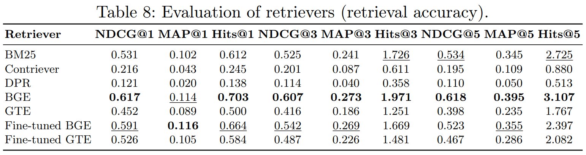
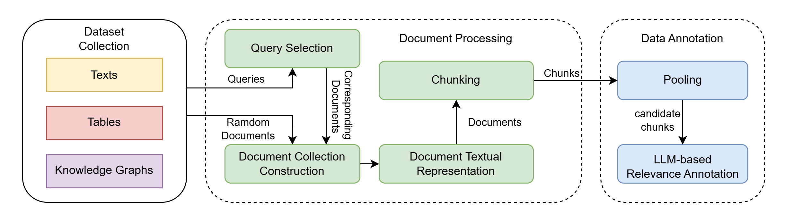

# mmRAG: A Modular Benchmark for Retrieval-Augmented Generation over Text, Tables, and Knowledge Graphs

This repository provides the code for the paper **"mmRAG: A Modular Benchmark for Retrieval-Augmented Generation over Text, Tables, and Knowledge Graphs"**.

---

## 🔗 Data

The mmRAG dataset is avaliable at [Hugging Face](https://huggingface.co/datasets/Askio/mmrag_benchmark).

## mmRAG Overview
Retrieval-Augmented Generation (RAG) has emerged as a powerful paradigm for enhancing the capabilities of large language models. However, existing RAG evaluation predominantly focuses on text retrieval and relies on opaque, end-to-end assessments of generated outputs. To address these limitations, we introduce mmRAG, a modular benchmark designed for evaluating multi-modal RAG systems. Our benchmark integrates queries from six diverse question-answering datasets spanning text, tables, and knowledge graphs, which we uniformly convert into retrievable documents. To enable direct, granular evaluation of individual RAG components—such as the accuracy of retrieval and query routing—beyond end-to-end generation quality, we follow standard information retrieval procedures to annotate document relevance and derive dataset relevance. We establish baseline performance by evaluating a wide range of RAG implementations on mmRAG.

In this repository, we provide our source code for constructing mmRAG dataset and evaluating experienmens provided in our paper.

## 🧪 Experiments
We provide our dataset and annotation results in `data/` folder. The source codes of experiments are in `mmrag_experiments/` folder.

### Retrieval:

#### Setup:
We use BM25, Contriever, DPR, bge-large-en-v1.5, gte-large-en-v1.5 as example retrievers. For BM25, we need to use another python environment with JDK and pyserini.

For other retrievers, install all required packages by using `pip install -r retrieval_requirements.txt`

#### Build Index and Retrieve
for each dense retriever, we need to build index for our chunks. In `mmrag_experiments/retrievers/{your_retriever}`, there are two python scripts `build_index.py` and `retrieve.py`. Run `build_index.py` to generate embeddings and faiss index in `./cache/` in each folder, and then run `retrieve.py` to generate retrieval result `result_{your_retriever}.json`

#### Fine-tune models
Fine-tune models can be trained using FlagEmbedding.

#### Evaluation

You can run `mmrag_experiments/eval.py` to see the evaluations of retrievers. In our experiment, we got the result in following graph:


### Generation:

You can run `mmrag_experiments/exp/generation_exp.py` to run the generation experiment. In `load_test_data()`. Set LLM like `glm_model = llm.GLM("glm-4-plus")`, and remember to fill information like api-key in `llm.py`.


### Generation with spcific-dataset chunks:

Also in `mmrag_experiments/exp/generation_exp.py`, in `load_test_data()`, you can set if to set dataset limitation.

### Generation with query router:

You can do query routing tests in `mmrag_experiments/exp/routing`. We provide 3 basic router as example: `mmrag_experiments/exp/routing/oracle_router.py`, `mmrag_experiments/exp/routing/llm_router.py`, and `mmrag_experiments/exp/routing/semantic_router.py`, where the oracle_router uses dataset-level labels in mmRAG. You can implement your custom router and save the routing result in corresponsing json files. After routing results are generated, generation experiments can be done in `generate_exp.py`.

## 🧾 mmRAG Construction


Note: Due to randomness of LLM generation, the queries selected may not completely the same with our current dataset.

### Source Dataset download

In mmRAG, we use NQ, TriviaQA, OTT, TAT, CWQ, WebQSP as data sources. 

NQ and TriviaQA can be accessed from HuggingFace, using `load_dataset()` provided by `dataset` package.

[OTT](https://github.com/wenhuchen/OTT-QA) and [TAT](https://nextplusplus.github.io/TAT-QA/) datasets can be downloaded from there websites.

[CWQ](https://www.dropbox.com/scl/fo/nqujvpg2gc4y0ozkw3wgr/AOzjVEsdUhv2Fx2pamfJlSw?rlkey=746t7xehfqxf1zr867nxiq8aq&e=1), [WebQSP](https://www.microsoft.com/en-us/research/publication/the-value-of-semantic-parse-labeling-for-knowledge-base-question-answering-2/), and the [Knowledge Graph (Freebase)](https://github.com/dki-lab/Freebase-Setup) can be downloaded and setup following [ChatKBQA](https://github.com/LHRLAB/ChatKBQA):

[dataset_loader.py](mmrag_construction/filter/dataset_loader.py) provides the basic functions to load and process the datasets. After your downloading all these datasets and start the Freebase SPARQL dump, modify all the `dataset_path` and path in `load_dataset` function in the corresponding class. For CWQ_reader and   WebQSP_reader, the `kb_dump` path also need to be filled. You can try to run `dataset_loader.py` to test whether all datasets are correctly loaded.

### Query Selection, Documents Representation and Collection

Run [filter.py](mmrag_construction/filter/filter.py) to generate queries for each source dataset and corresponding documents and ramdom chaos socuments.

Run [add_chaos_and_process_kg_documents.py](mmrag_construction/filter/add_chaos_and_process_kg_documents.py) to chunk documents.

### Pooling

**Note: BM25 needs different python environment with BGE.**

#### BM25

Using `pyserini` and java JDK environment, run codes in ``mmrag_construction/pooling/bm25`: first `mmrag_construction/pooling/bm25/file_perpare.py`, then `bash generate_index.sh`, and `mmrag_construction/pooling/bm25/bm25query.py`.

#### BGE

Run `mmrag_construction/pooling/bge/bge_query.py` with BM25 results.

### LLM Annotation

Run `mmrag_construction/llm_marker/mark.py`, the chunk-level annotation will be generated.

### Final processing

After LLM Annotation, we run `mmrag_construction/generate_dataset/add_dataset_score.py` to generate the dataset-level relevance labels. Then run `mmrag_construction/generate_dataset/gen_dataset.py` to generate json file of dataset, use `partition.py` to make a train-test-dev split.


<!-- ## 📄 Citation
If you find our work helpful, use the citation:
```bibtex
@misc{mmragds,
	author       = { Chuan Xu and Qiaosheng Chen and Yutong Feng and Gong Cheng },
	title        = { mmrag\_benchmark (Revision 72f010b) },
	year         = 2025,
	url          = { https://huggingface.co/datasets/Askio/mmrag\_benchmark },
	doi          = { 10.57967/hf/5475 },
	publisher    = { Hugging Face }
}
``` -->
